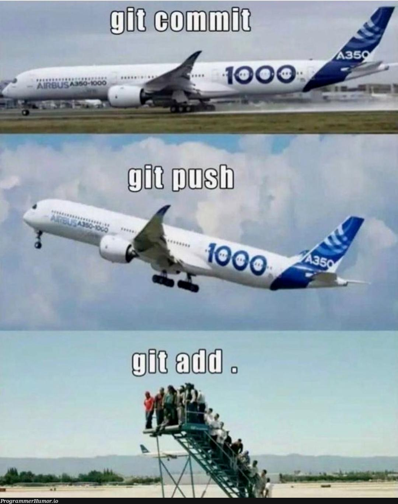

# Git Recap

Software development requires a safe way to track changes in code. **Version control** helps you answer:

- Who changed the code?
- When was it changed?
- What was changed?
- Can we revert to an earlier version?

Git is the tool we use to manage version control. For a deeper explanation, see the [official Git documentation](https://git-scm.com/book/en/v2/Getting-Started-What-is-Git%3F).

## Table of Contents

- [Git vs GitHub](#git-vs-github)
- [Core Concepts](#core-concepts)
  - [What Does Git Track?](#what-does-git-track)
  - [Repositories: Local and Remote](#repositories-local-and-remote)
  - [Forks and Upstream](#forks-and-upstream)
  - [The Three Stages of Git](#the-three-stages-of-git)
- [Git Main Commands](#git-main-commands)
  - [clone](#clone)
  - [fetch](#fetch)
  - [pull](#pull)
  - [status](#status)
  - [add](#add)
  - [stash and stash pop](#stash-and-stash-pop)
  - [commit](#commit)
  - [push](#push)
  - [merge](#merge)
  - [checkout](#checkout)
- [Exercise](#exercise)


## Git vs GitHub

It is important to understand the difference:

- **Git** is a version control tool installed on your computer.
- **GitHub** is a website that hosts Git repositories online.

In this course, we use Git locally (in the terminal) and GitHub to store and share code. You are expected to create a public GitHub repository and use Git to upload your work.


## Core Concepts

### What Does Git Track?

Git tracks changes to files inside a project folder. Specifically, it tracks new files, modified files, deleted files, and the full history of all changes.

{: .important }
Git does NOT automatically track everything. Files must be explicitly added to Git before it starts watching them.

### Repositories: Local and Remote

A **repository** (or *repo*) is a project folder that Git tracks. It contains your project files and a hidden `.git` folder that stores the full version history.

There are two types: a **local repository** on your computer, and a **remote repository** hosted online (e.g., on GitHub).

**What is a remote and what is `origin`?**

A *remote* is a named reference to a repository hosted somewhere else, typically GitHub. When you clone a repository, Git automatically creates a remote called **`origin`** that points back to the URL you cloned from.

```bash
git remote -v
# origin  https://github.com/marco-saretta/python-workshop.git (fetch)
# origin  https://github.com/marco-saretta/python-workshop.git (push)
```

You can have multiple remotes. `origin` is just the conventional name for the primary one.

### Forks and Upstream

A **fork** is your personal copy of someone else's repository, hosted on your own GitHub account. Forks are useful when you want to contribute to a project you do not own.

When you fork and then clone, you typically have two remotes:

| Remote | Points to |
|--------|-----------|
| `origin` | Your fork on GitHub |
| `upstream` | The original repository you forked from |

You set up `upstream` manually so you can pull in changes from the original project:

```bash
git remote add upstream https://github.com/original-author/python-workshop.git
git remote -v
# origin    https://github.com/your-username/python-workshop.git (fetch)
# upstream  https://github.com/original-author/python-workshop.git (fetch)
```

To sync your fork with the latest changes from the original:

```bash
git fetch upstream
git merge upstream/main
```

### The Three Stages of Git

Git works in three main steps:

```
Working Directory  ->  Staging Area (Index)  ->  Commit (History)
   (edit files)          (git add)                (git commit)
```

**Working Directory** is where you edit files freely. The **Staging Area** is where you prepare a set of changes before saving them. A **Commit** is a permanent snapshot of your staged changes, stored in history.

This separation gives you control: you can edit many files but only commit a specific subset of them.



## Git Main Commands

This section walks through the core Git commands in the order you would use them in a typical workflow: get the code, make changes, then share them.

### Clone

`git clone` downloads a remote repository to your computer. You can clone using **HTTPS** or **SSH**:

| Method | URL format | Requires |
|--------|-----------|----------|
| HTTPS | `https://github.com/user/repo.git` | GitHub username and password/token |
| SSH | `git@github.com:user/repo.git` | SSH key configured on GitHub |

HTTPS is simpler to start with. SSH is preferred for regular work because it does not require entering credentials each time.

Open a terminal (Git Bash on Windows, or any terminal on Mac/Linux) and run:

```bash
git clone https://github.com/marco-saretta/python-workshop.git
cd python-workshop
```

After cloning, `cd python-workshop` moves you into the new local folder. Git has automatically set `origin` to point to the GitHub URL.

### Fetch

`git fetch` downloads the latest changes from a remote **without applying them** to your working directory. It updates your local knowledge of what exists remotely, but leaves your files untouched.

```bash
git fetch origin
```

Think of it as checking what is new on the remote without changing anything yet. This is useful for inspecting remote changes before deciding to merge them.

### Pull

`git pull` downloads the latest changes from the remote **and immediately applies them** to your current branch. It is effectively `git fetch` followed by `git merge`.

```bash
git pull
```

{: .note }
Git defaults to `origin` so you can usually just run `git pull` without specifying anything else. The full form `git pull origin main` is useful when you want to be explicit about which remote and branch to pull from.

{: .warning }
If you have local uncommitted changes that conflict with incoming changes, `git pull` may fail. Use `git stash` first — see the [stash](#stash-and-stash-pop) section below.

### Status

`git status` is your most important command for understanding what is happening in your repository at any given moment. It shows which files have been **modified** but not staged, which are **staged** and ready to commit, and which are **untracked**.

```bash
git status
```

Example output:

```
On branch main
Changes not staged for commit:
  modified:   app.py

Untracked files:
  new_script.py
```

{: .note }
Run `git status` frequently — before and after every other command — to stay oriented. It is impossible to run it too often.

### Add

`git add` moves changes from the working directory to the **staging area**. Only staged changes will be included in the next commit.

```bash
# Stage a single file
git add app.py

# Stage multiple files
git add app.py utils.py

# Stage all changed and new files in the current directory
git add .
```

{: .highlight }
Prefer staging specific files rather than `git add .` — it forces you to review exactly what you are about to commit.

### Stash and Stash Pop

`git stash` temporarily shelves your uncommitted changes so you can switch context without losing work or committing unfinished code.

```bash
# Save current changes to the stash
git stash

# Your working directory is now clean
git status  # nothing to commit

# ... do other work, e.g. git pull or git checkout another-branch ...

# Restore your stashed changes
git stash pop
```

`git stash pop` restores the most recently stashed changes and removes them from the stash. If you want to keep the stash entry after restoring, use `git stash apply` instead.

You can view all stashed entries with:

```bash
git stash list
# stash@{0}: WIP on main: abc1234 Add login validation
```

### Commit

`git commit` saves a permanent snapshot of your staged changes to the repository's history.

```bash
git commit -m "Add login validation"
```

The `-m` flag lets you write a short commit message inline. This message should describe *what* changed and *why*.

**Good commit messages:**

```bash
git commit -m "Fix off-by-one error in date parser"
git commit -m "Add unit tests for user authentication"
git commit -m "Remove unused import in config.py"
```

**Bad commit messages:**

```bash
git commit -m "fix"
git commit -m "changes"
git commit -m "asdfgh"
```

{: .important }
A commit only includes what you have staged with `git add`. Unstaged changes remain in your working directory and will not be included.

**The full edit, stage, commit cycle:**

```bash
# 1. Make changes to app.py in your editor

# 2. Check what changed
git status

# 3. Stage the file
git add app.py

# 4. Confirm what is staged
git status

# 5. Commit
git commit -m "Add login validation"
```

### Push

`git push` uploads your local commits to a remote repository, making them available to others.

```bash
git push
```

{: .note }
As with `git pull`, Git defaults to `origin` so you can usually just run `git push`. The full form makes it explicit which remote and branch you are targeting:

```bash
git push origin main

# Or for a feature branch:
git push origin my-feature-branch
```

{: .highlight }
Before pushing, it is good practice to run `git pull` first to make sure your local branch is up to date. This reduces the chance of conflicts.

### Merge

`git merge` integrates changes from one branch into another. The most common use case is merging a feature branch back into `main` once the work is complete.

```bash
# Switch to the branch you want to merge INTO
git checkout main

# Merge the feature branch
git merge my-feature-branch
```

If the branches have no conflicting changes, Git performs a **fast-forward merge** automatically. If the same lines were changed in both branches, Git reports a **merge conflict**. You must manually edit the conflicting files, then stage and commit the resolution:

```bash
# After resolving conflicts in your editor:
git add conflicted-file.py
git commit -m "Resolve merge conflict in conflicted-file.py"
```

### Checkout

`git checkout` is used to switch between branches or restore files to a previous state.

```bash
# Switch to an existing branch
git checkout main

# Create and switch to a new branch in one step
git checkout -b new-feature
```

Creating a new branch with `-b` is the most common way to start new work: branch off from `main`, make your changes, then merge back when done.

**Restore a single file to its last committed state (discard local changes):**

```bash
git checkout -- app.py
```

{: .warning }
`git checkout -- <file>` permanently discards your unsaved changes to that file. There is no undo.

{: .note }
In newer versions of Git, `git switch` is the preferred command for switching branches, and `git restore` for discarding file changes. `git checkout` still works and remains widely used.


## Exercise

In this exercise you will go through the full Git workflow hands-on and encounter a realistic permission error at the end.

**Step 1: Clone the workshop repository**

```bash
git clone https://github.com/marco-saretta/python-workshop.git
cd python-workshop
```

**Step 2: Check the remote**

Verify that Git has set up `origin` correctly:

```bash
git remote -v
```

You should see two lines showing the repository URL, one for fetch and one for push.

**Step 3: Create a new branch and switch to it**

```bash
git checkout -b yourname-test-branch
```

Confirm you are on the new branch:

```bash
git status
# On branch yourname-test-branch
```

**Step 4: Make a change and commit it**

```bash
echo "Hello from yourname" > yourname_notes.txt
git add yourname_notes.txt
git commit -m "Add notes file for yourname"
```

**Step 5: Try to push**

```bash
git push origin yourname-test-branch
```

You will see an error like this:

```
remote: Permission to marco-saretta/python-workshop.git denied to yourname.
fatal: unable to access '...': The requested URL returned error: 403
```

{: .important }
This is expected and is not a mistake on your part. The repository is owned by someone else and you do not have write access. This is exactly why **forks** exist: you would fork the repository to your own account, clone your fork, push there, and then open a **pull request** to propose your changes back to the original.


**Setting up your own repository**

For the rest of the course you will need a repository you own so you can push freely.

Go to [github.com](https://github.com), log in, click "+" in the top right, and select "New repository". Give it a name, set it to public, and click "Create repository".

You have two options depending on your situation.

**Option A: Start fresh by cloning your new empty repo**

```bash
git clone https://github.com/your-username/python-workshop.git
cd python-workshop
```

**Option B: Connect an existing local folder to your new repo**

```bash
cd your-existing-folder
git init
git remote add origin https://github.com/your-username/python-workshop.git
git add .
git commit -m "Initial commit"
git push -u origin main
```

{: .note }
The `-u` flag on the first push sets `origin main` as the default tracking branch. From that point on you can just run `git push` and `git pull` without any extra arguments.