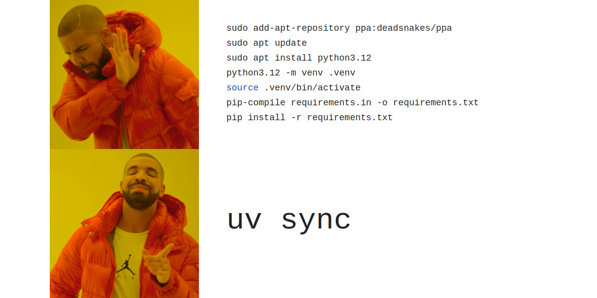

## Table of Contents

- [The Problem uv Solves](#the-problem-uv-solves)
- [uv vs Conda](#uv-vs-conda)
- [Virtual Environments and .venv](#virtual-environments-and-venv)
  - [Activating a virtual environment](#activating-a-virtual-environment)
- [Core uv Commands](#core-uv-commands)
  - [uv init](#uv-init)
  - [uv add](#uv-add)
  - [uv sync](#uv-sync)
- [The pyproject.toml File](#the-pyprojecttoml-file)
- [A Note on Pixi](#a-note-on-pixi)
- [Exercise](#exercise)


# Package Management with uv

Every Python project needs a way to manage its dependencies: the external libraries your code relies on. This section introduces **uv**, the tool we use in this course, explains the concept of virtual environments, and briefly covers alternatives like Conda and Pixi.


## The Problem uv Solves

When you work on multiple Python projects, they will often require different versions of the same library. Project A might need `pandas 1.5`, while Project B needs `pandas 2.1`. If you install everything globally, these versions clash and eventually break each other.

The standard solution is to give each project its own isolated Python environment with its own set of packages. **uv** is a modern tool that handles this cleanly and very quickly. It manages your Python version, your virtual environment, and your dependencies all in one place.

uv is written in Rust, which makes it substantially faster than older tools like pip or conda for installing packages.


## uv vs Conda

You may have used **Conda** (or its smaller variant, Miniconda) before. Both tools solve the same problem - isolated environments with specific dependencies - but they take a different approach.

| Feature | uv | Conda |
|---------|----|-------|
| Focus | Python-only | Multi-language |
| Speed | Extremely fast | Slower |
| Env location | `.venv/` (project-local) | `~/miniconda3/envs/` |
| Config | `pyproject.toml` | `environment.yml` |
| Best for | Python projects | Scientific stacks |

The key practical difference is where the environment lives. With Conda, all environments are stored in a single central directory on your machine, separate from your project. With uv, the environment sits directly inside your project folder in a folder called `.venv`. This makes it obvious what belongs to what, and it travels with your project.

When you create a project with uv, it creates a `.venv` folder inside your project directory:

```
my-project/
    .venv/          <- the virtual environment lives here
        bin/
            python
            pip
            activate
        lib/
            python3.12/
                site-packages/   <- installed packages go here
    src/
    pyproject.toml
```

The Python executable inside `.venv/bin/python` is the one your project uses. Your installed packages go into `.venv/lib/`. Nothing touches the system Python.

Because `.venv` is just a folder inside your project, you always know exactly where it is. If something goes wrong, you can delete it and recreate it in seconds with `uv sync`.

{: .note }
 `.venv` should be added to your `.gitignore`. You never commit the environment itself to Git, only the `pyproject.toml` that describes it. Anyone who clones your repo can recreate the exact environment by running `uv sync`.

## Core uv Commands

### uv init

`uv init` creates a new project folder with the standard structure and files.

```bash
uv init my-project
cd my-project
```

This creates:

```
my-project/
    .python-version     <- pins the Python version
    pyproject.toml      <- project metadata and dependencies
    README.md
    src/
        my_project/
            __init__.py
```

uv also creates a `.venv` folder and installs the base Python version automatically. You are ready to start adding packages immediately.

If you want to initialise uv inside an existing folder instead of creating a new one:

```bash
cd existing-folder
uv init
```

### uv add

`uv add` installs a package into your project and records it in `pyproject.toml`.

```bash
uv add requests
uv add pandas numpy
uv add pytest --dev
```

The `--dev` flag marks a package as a development dependency: something needed for testing or tooling but not for running the project in production (e.g., pytest, ruff, black).

After running `uv add`, two things happen: the package is installed into `.venv`, and `pyproject.toml` is updated to record the new dependency. You should commit `pyproject.toml` to Git so others can reproduce your environment.

### uv sync

This is your swiss-army knife. 

`uv sync` reads `pyproject.toml` and installs all the listed dependencies into `.venv`. It is the command you run after cloning a project to get the environment set up.

```bash
uv sync
```

If `.venv` does not exist yet, uv creates it. If packages are already installed but out of date with `pyproject.toml`, uv updates them. If a package is installed but no longer listed in `pyproject.toml`, uv removes it.

This makes `uv sync` the single source of truth: what is in `pyproject.toml` is exactly what ends up in `.venv`.

## The pyproject.toml File

`pyproject.toml` is the central configuration file for your project. It replaces the older `requirements.txt` and `setup.py` approaches and is the current standard for Python projects.

A typical file looks like this:

```toml
[project]
name = "my-project"
version = "0.1.0"
description = "A short description of the project"
requires-python = ">=3.11"

dependencies = [
    "pandas>=2.0",
    "requests>=2.28",
]

[build-system]
requires = ["hatchling"]
build-backend = "hatchling.build"
```

The `dependencies` list is what `uv add` writes to when you install a package. The `requires-python` field pins the minimum Python version. The `dev` optional group is what gets populated with `uv add --dev`.

You can also configure tools like Ruff directly in `pyproject.toml`:

```toml
[tool.ruff]
line-length = 88
```

This keeps all project configuration in a single file rather than scattered across `.flake8`, `setup.cfg`, and other tool-specific files.


## A Note on Pixi

**Pixi** is a newer package manager built on top of the Conda ecosystem. It uses a `pixi.toml` file (similar to `pyproject.toml`) and supports multiple languages and platforms from one configuration.

- What Pixi does well: it handles complex mixed-language dependency stacks cleanly, it is faster than traditional Conda, and its lockfile approach (similar to uv) gives you reproducible environments.

- What Pixi cannot do: it does not integrate as seamlessly into the Python-only tooling ecosystem. Features like editable installs, Python packaging, and publishing to PyPI are less mature than in uv. If your project is purely Python, uv is simpler and better supported.


{: .note }
[More about uv vs pixi](https://jacobtomlinson.dev/posts/2025/python-package-managers-uv-vs-pixi/)


## Exercise

Navigate to your workshop directory first:

```bash
cd python-workshop
```

### Step 1: Install uv (PowerShell)**

```powershell
powershell -ExecutionPolicy ByPass -c "irm https://astral.sh/uv/install.ps1 | iex"
uv --version
```

### Step 2: Run the test script (fails)**

```bash
uv run m1_base_setup/exercise_files/uv_test.py
```
**Expected error:** `ModuleNotFoundError: No module named 'numpy'`

### Step 3: Check current state

```bash
uv pip list
```

Shows empty or missing numpy.

### Step 4: Add numpy

```bash
uv add numpy
```

Open `pyproject.toml` again. Notice that `numpy` has been added to the `dependencies` list automatically.

Now look inside `.venv`:

```bash
ls .venv/lib/
```

### Step 5: Sync & verify

```bash
uv sync
uv pip list
```

Now numpy now installed in `.venv`.

### Step 6: Test success

```bash
uv run m1_base_setup/exercise_files/uv_test.py
```

Script runs! No activation needed.

### Step 7: Fresh clone simulation

```bash
rm -rf .venv  # Simulate git clone
uv sync       # Rebuilds from pyproject.toml
uv run m1_base_setup/exercise_files/uv_test.py  # Works perfectly
```

### Key takeaways

- `uv add` → installs + updates `pyproject.toml`
- `uv sync` → exact reproduction from `pyproject.toml`
- `uv run` → runs scripts in project env (no activation)
- **Commit only** `pyproject.toml` to Git
