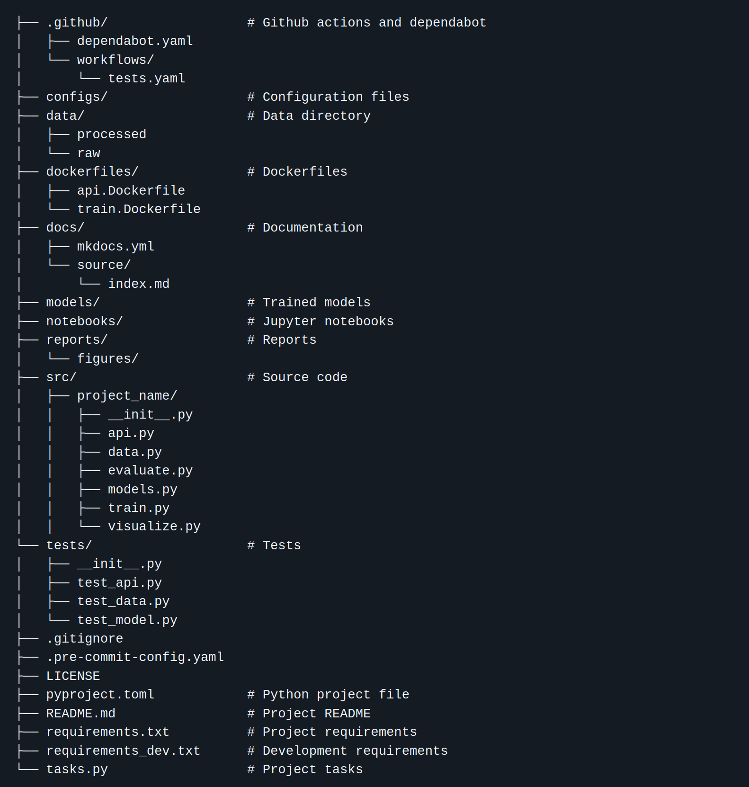

# Cookiecutter Templates

When you start new Python projects often, setting up the same structure each time gets repetitive. **Cookiecutter** helps by generating projects from templates.

## What Is Cookiecutter?

[Cookiecutter](https://cookiecutter.readthedocs.io/en/latest/) is a command-line tool that creates projects from templates (stored locally or online).

Install it with:

```bash
uvx cookiecutter
```

Shown below is the default code structure of cookiecutter for data science projects.



## Using a Template

Run Cookiecutter with a public template, such as the official Python package template:

```bash
uvx cookiecutter <url-to-template>
```

We will use this template:

```bash
uvx cookiecutter https://github.com/SkafteNicki/mlops_template
```


Then answer the prompts (e.g., project name, author, license). Cookiecutter will generate a new directory with everything preconfigured:
```
my_new_package/
├── src/
├── tests/
├── setup.cfg
└── pyproject.toml
```

## Creating Your Own Template

You can create a folder with placeholders like `{{ cookiecutter.project_name }}`:

```
my_template/
└── {{ cookiecutter.project_name }}/
    ├── README.md
    ├── setup.py
    └── src/{{ cookiecutter.project_slug }}/__init__.py
```

Then use:

```bash
cookiecutter path/to/my_template
```

This is great for workshops, teams, or consistent internal projects.

## Example Use Case

Suppose your team always uses the `src` layout and Pytest. You can make a template that sets this up automatically, ensuring every new project starts with the same structure and test setup.